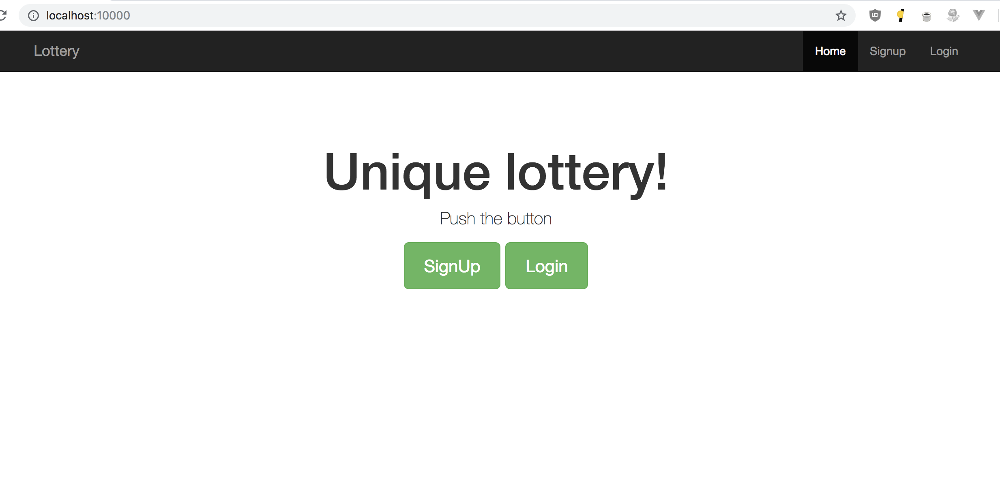
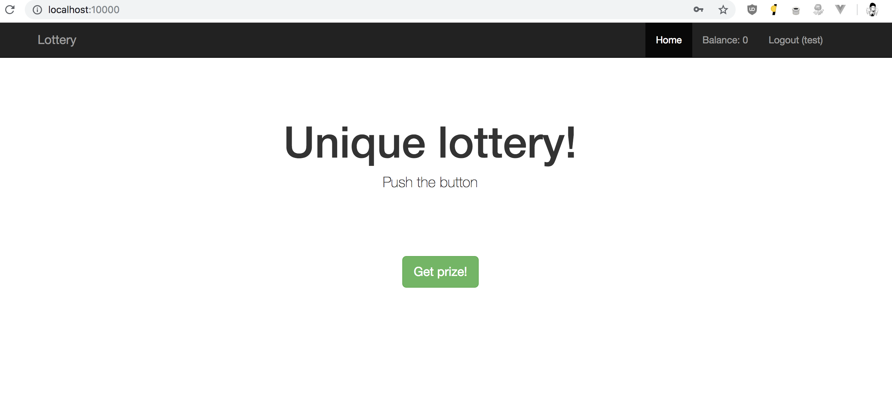
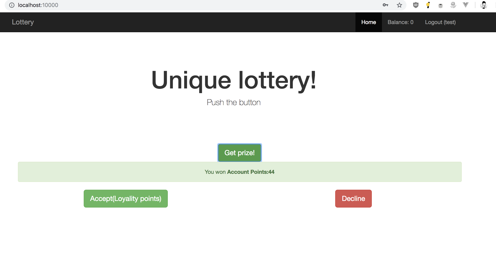
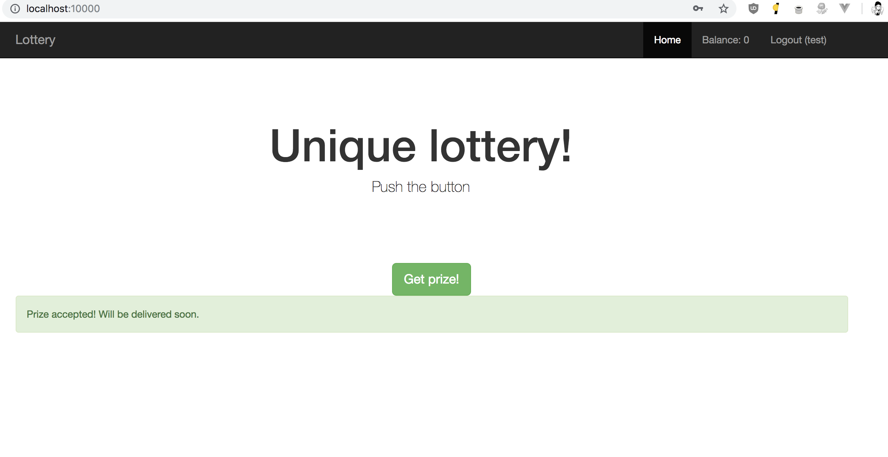
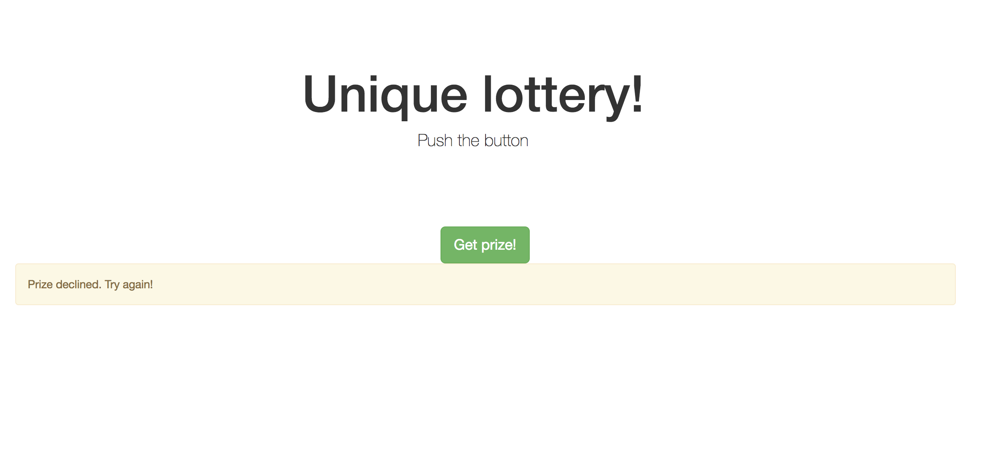
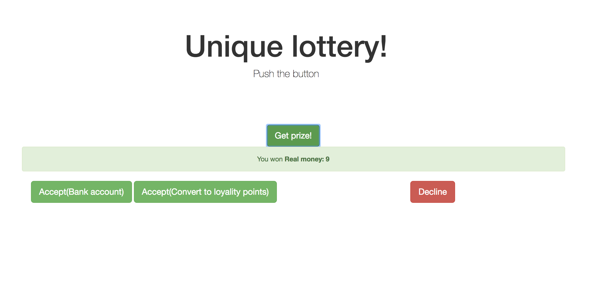

## Краткое описание проекта
Каждый из возможных призов имеет свой набор доставок, например физический товар - доставку почтой, денежный приз - зачисление на банковский счет(http-запрос) или конвертация в баллы лояльности(с определенным коэф, который задается в настройках приложения)

При выборе приза, он резервируется за пользователем, пока тот не подтвердит получение или не откажется от приза. При этом, если приз денежный, то общий денежный фонд уменьшается на сумму приза, чтобы не получить отрицательный фонд при параллельных запросах несколькиз пользователей. Так же происходит и с физическими предметами. В случае отказа - фонд восполняется, либо предмет возвращается в список доступных(каждый предмет обладает своим количеством). Пользователь не может получить новый приз пока не подтвердит или не откажется от текущего. При подтверждении приза - в очередь ставится задача на доставку.
Доставка приза(разбор очереди) осуществляется командой	`php yii delivery/run` или, если через докер, `docker-compose exec front php yii delivery/run`

## Инструкция по запуску
Проект выполнен в docker-окружении, поэтому для запуска достаточно выполнить команду `docker-compose up -d --build` в корне проекта, и дождаться когда будет завершена загрузка образов и установка приложения(загрузка composer-пакетов)
После чего он будет доступен по адресу `http://localhost:10000/`

В случае если проект необходимо запустить отдельно, следует в `.env` прописать все необходимы доступы, к базе и моку банковского апи.
Команда для запуска `composer install; php init --env=Development; php yii migrate --interactive=0; php yii_test migrate --interactive=0`

## Тесты
Команда для запуска тестов `docker-compose exec front ./vendor/bin/codecept run unit -c common gifter`

В наличии два тестовых набора - на конвертацию `ConvertPointsTest` и общий `WorkflowTest`

## Интерфейс

